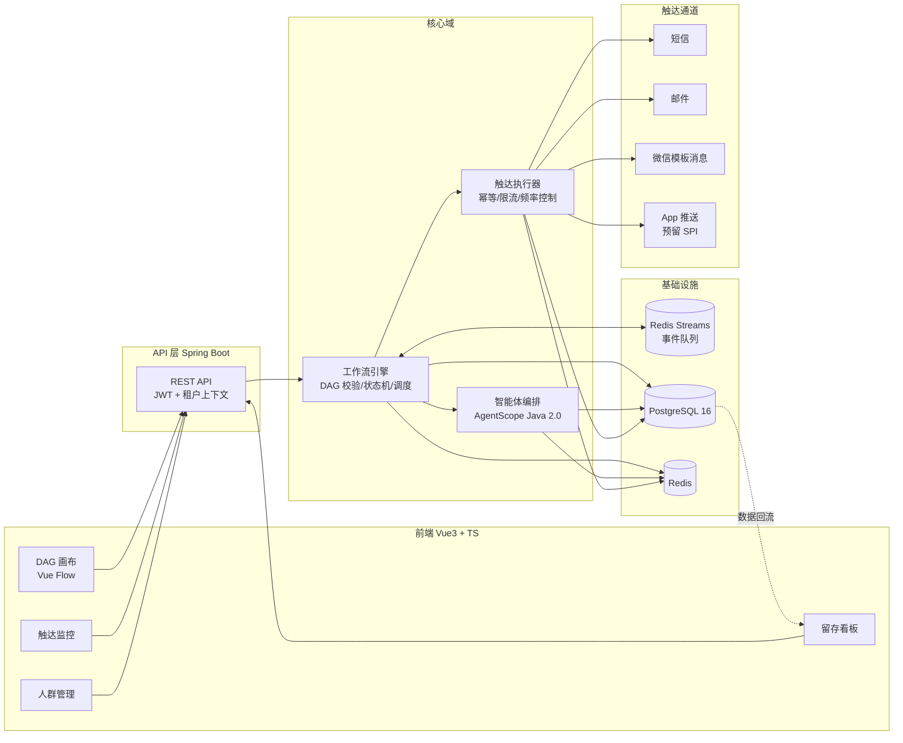

# ea-sys 智能运营多通道触达系统

多租户 SaaS 客户留存系统：运营人员在画布上以 DAG 方式编排触达工作流，按定时 / 事件 / 手动 / API 触发，经智能体动态分层与通道路由，通过短信、邮件、App 推送等多通道完成全方位多触达，并以数据回流驱动留存优化。

## 核心闭环

```
运营配置人群规则 + 编排 DAG 工作流
  → 触发（定时 / 事件 / 手动 / API）
  → 人群圈选快照（冻结成员）
  → 智能体动态分层（通道可用性 / 画像 / 风险）
  → 引擎按 DAG 执行（条件分流 → 通道动作 → 延迟 → 并行分支）
  → 触达记录 + 回执回流 → 留存看板 → 运营迭代优化
```

## 系统架构



## 技术栈

| 层 | 选型 |
|---|---|
| 后端 | Java 21 + Spring Boot 3.x + MyBatis-Plus |
| 存储 | PostgreSQL 16 + Flyway |
| 缓存 / 锁 / 限流 | Redis |
| 消息队列 | Redis Streams（Redisson 消费者组 + ACK；预留 RocketMQ 迁移位）|
| 智能体 | AgentScope Java 2.0 |
| 前端 | Vue 3 + TypeScript + Element Plus（DAG 画布 Vue Flow）|
| 触达通道 | 短信 / 邮件 / 微信模板消息（App 推送预留 SPI 扩展位）|

## 里程碑

| 里程碑 | 内容 | 状态 |
|---|---|---|
| M0 | 工程骨架：多模块 / Flyway 基线 / 租户上下文 / JWT / 空链路 | 完成 |
| M1 | contact + audience 人群圈选 API（规则 DSL / 快照冻结）| 完成 |
| M2 | DAG 工作流引擎（节点 / 校验 / 发布 / 干跑报告 / 条件分流）| 完成 |
| M3 | 触达执行（通道适配器 / 模板渲染 / 幂等 / 频率控制 / 回执）| 完成 |
| M4 | 智能体（分层 / 路由 + 策略草稿编辑，schema 校验 + 确定性降级 + 审计）| 完成 |
| M5 | 留存看板（漏斗 / 留存 / 渠道 / 工作流效果）+ 流失预警 Agent | 完成 |
| M6 | agent 层接入 AgentScope Java 2.0，LLM 主提供方 + 降级链路 | 完成 |
| M6b | 触发双模式执行（定时轮询 / 事件 / API 触发入流）| 完成 |
| 工具面 | 前端（登录 / 人群 / 画布 / 触达模板 / 触达监控 / 智能体配置 / 留存看板）| 完成 |

> 已落地：计划导入校验（Excel / CSV 解析 + 8 维确定性校验 + 发布闸门）、AB / 灰度（条件 DSL `percentage` 按 contact.id 稳定哈希分流）、消息队列（事件触发异步化：Redis Streams 消费者组），事件链路触发 → 匹配 EVENT 流程异步执行。后续扩展：真实通道供应商 API 适配、消息队列 RocketMQ 迁移、智能运营策略 Agent 化。触达适配器（短信 / 邮件 / 微信模板消息）已实现：凭据经 channel_config 按租户注入，未配凭据时降级 console 日志下发。

## 文档索引

| 文档 | 内容 |
|---|---|
| [docs/01-architecture.md](docs/01-architecture.md) | 系统定位、架构、模块划分、多租户、通道适配层 |
| [docs/02-data-model.md](docs/02-data-model.md) | 数据库表设计 |
| [docs/03-workflow-engine.md](docs/03-workflow-engine.md) | DAG 引擎、触发双模式、执行语义、治理 |
| [docs/04-agent-design.md](docs/04-agent-design.md) | 智能体设计（分层 / 路由 / 流失预警）|
| [docs/05-roadmap.md](docs/05-roadmap.md) | 分期路线图与风险 |
| [docs/06-frontend.md](docs/06-frontend.md) | 前端界面设计（画布编排、页面明细、API 契约）|
| [docs/07-plan-template.md](docs/07-plan-template.md) | 运营计划导入模板（Excel v1 列结构）|

## 当前状态

M0–M6 核心闭环完成：五模块（common / engine / agent / channel / api）+ 人群圈选 / DAG 编排 / 触达执行 / 分层路由智能体 / 留存看板 / 流失预警，配套 Vue3+TS 前端（登录、人群、画布、模板、触达监控、智能体配置、留存看板）。分层策略支持草稿编辑与按规则路由。开发账号 `admin / admin123`（dev profile 自动初始化租户 1）。

待续：真实通道供应商 API 适配、消息队列 RocketMQ 迁移、策略 Agent 化。已具备：计划导入校验、AB / 灰度分流（percentage 操作符）、Redis Streams 事件消息队列。

## Docker 化部署（全套）

根 `docker-compose.yml` 一键启动整套：PostgreSQL / Redis 基础设施 + api（8080）/ notify（8092）/ web（前端，宿主 5173 → 容器 nginx 80，`/api/` 反代到 api 服务）+ 三个 e2e 通道 mock（smtp / wechat / sms，仅 compose 内网，无宿主端口映射）。

```bash
# colima：指定 docker engine socket
export DOCKER_HOST=unix://$HOME/.colima/default/docker.sock

# 构建镜像（首次 maven 依赖下载较慢，约 8-9 分钟）
docker compose build

# 启动全套
docker compose up -d

# 查看状态（api / notify healthy 即就绪）
docker compose ps
```

访问地址：

| 服务 | 地址 |
|---|---|
| 前端 | http://localhost:5173 |
| API | http://localhost:8080 |
| notify | http://localhost:8092 |
| 开发账号 | admin / admin123（dev profile 自动初始化租户 1）|

说明：

- API 容器访问通道 mock 走 compose 服务名（`smtp-mock:3025` / `sms-mock:8089` / `wechat-mock:8090`），通道配置经 `PUT /api/channel-configs/{channel}` 加密保存，默认已指向容器内服务名。宿主 3025 / 8090 / 8089 若被本地进程占用不影响容器化部署。
- LLM：宿主设置 `EA_LLM_API_KEY` 后在 `docker compose up` 前导出即启用真实 LLM；未设置时 `EA_LLM_ENABLED=true` 但密钥为空，agent 降级确定性 fallback（驾驶舱聚合 / 聊天记账不受影响）。
- `notify` 模拟通道延迟 `NOTIFY_SIMULATE_DELAY_MS`（默认 500ms），回调 `http://api:8080/api/deliveries/callback`。
- 数据落卷 `ea-sys-pgdata` / `ea-sys-redisdata`（compose 命名卷，重建容器不丢数据）。

## 本地开发

```bash
# 1. 启动开发基础设施（PostgreSQL + Redis）
docker compose up -d

# 2. 构建 + 测试（colima / Docker Desktop 通用）
#    colima：需先设置下列环境变量（docker-java 与新版 Docker API 协商问题）
export DOCKER_HOST=unix://$HOME/.colima/default/docker.sock
export TESTCONTAINERS_DOCKER_SOCKET_OVERRIDE=/var/run/docker.sock
mvn -B -Dapi.version=1.44 verify

# 3. 启动应用（dev profile，端口 8080）
mvn -pl ea-sys-api spring-boot:run

# 4. 冒烟
curl -s localhost:8080/api/health
curl -s -X POST localhost:8080/api/auth/login \
  -H 'Content-Type: application/json' \
  -d '{"username":"admin","password":"admin123"}'
curl -s localhost:8080/api/whoami -H "Authorization: Bearer <token>"
```

> 说明：Testcontainers 需 Docker 环境；Docker ≥ 29 的 daemon 最低接受 API 1.40，而 docker-java 默认协商 1.32，
> 故构建需 `-Dapi.version=1.44`（< 25 的旧 daemon 低于 1.44 时去掉该项）。colima 下 Ryuk 需要
> `TESTCONTAINERS_DOCKER_SOCKET_OVERRIDE=/var/run/docker.sock` 指认 VM 内 socket 路径。