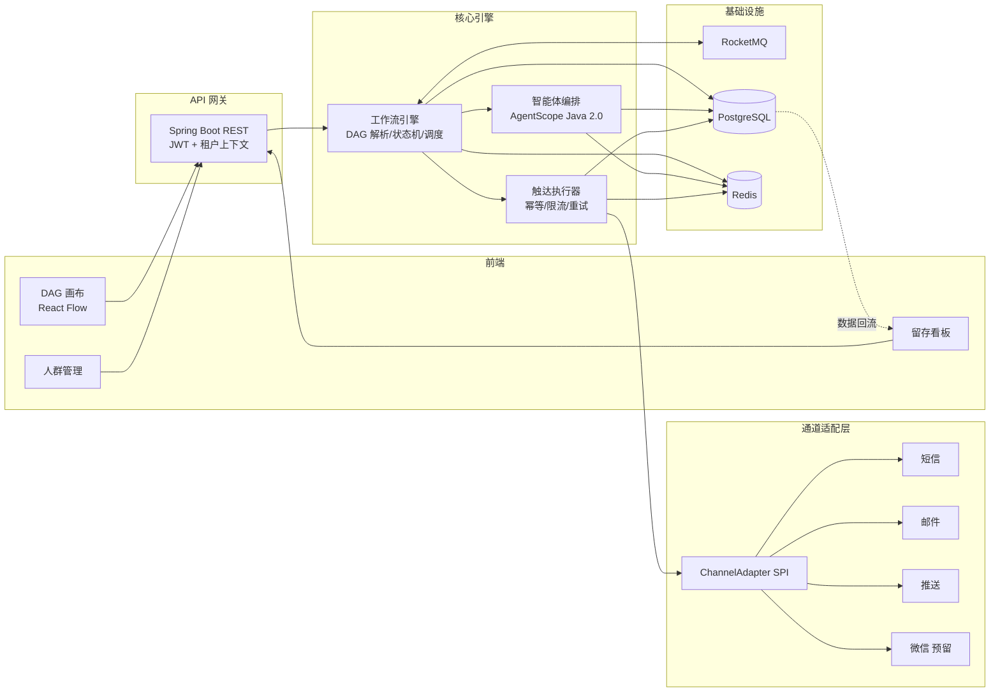

# 总体架构

## 1. 系统定位

全方位多触达的客户留存系统，简化运营人员工作。核心是「圈人选人 → 编排触达 → 执行反馈 → 数据回流优化」的留存闭环，而非群发工具：触达质量与频率控制优先于触达数量。

## 2. 架构图

## 3. 模块划分

| 模块 | 职责 |
|---|---|
| ea-sys-api | REST 接口、JWT + 租户上下文、参数校验 |
| ea-sys-engine | 工作流引擎：DAG 解析、节点状态机、调度、干跑 |
| ea-sys-agent | 智能体编排（AgentScope Java 2.0）：分层 / 路由 / 流失预警 |
| ea-sys-channel | 通道适配 SPI 与实现：短信 / 邮件 / 推送 |
| ea-sys-common | 租户上下文、统一异常、审计、通用工具 |

## 4. 执行链路

1. 运营配置人群规则（audience）+ 编排 DAG 工作流（workflow）
2. 触发（定时 / 事件 / 手动 / API）→ 人群圈选快照冻结成员
3. 智能体分层（通道可用性 / 画像 / 风险）→ 策略落标
4. 引擎按 DAG 执行：条件分流 → 通道动作 → 延迟 → 并行分支
5. 触达记录 + 回执回流 → 留存看板 → 运营迭代

## 5. 多租户设计

- **行级隔离**：全部业务表带 `tenant_id`；租户上下文（请求拦截器 → ThreadLocal），MyBatis-Plus 租户插件兜底
- **凭据隔离**：通道凭据按租户加密存储（Jasypt）
- **智能体隔离**：AgentScope 2.0 原生多租户 session + 自建行策略双保险
- **配额**：每租户每日触达上限、速率、成本预算，超限告警 + 熔断

## 6. 通道适配层

`ChannelAdapter` SPI 接口：

| 方法 | 说明 |
|---|---|
| `send(idempotencyKey, message)` | 发送，返回 `channel_msg_id` |
| `queryStatus(channelMsgId)` | 查询通道状态（如短信回执）|
| `handleCallback(payload)` | 回执 webhook 回调入口 |

- 通道：短信（阿里云 / 腾讯云）、邮件（SMTP / SES）、App 推送（APNs / 厂商通道）、微信（预留）
- 凭据按租户注入；模板 FreeMarker 渲染；失败指数退避重试，超限进死信队列

## 7. 关键技术决策

| 决策 | 理由 |
|---|---|
| 触发双模式（定时 / 立即）| 覆盖「计划性波次」与「事件实时响应」两类运营场景 |
| LLM 定策略、引擎执行量 | 人群可达十万级，LLM 只产出策略规则，批量执行走规则引擎 |
| 结构化规则 DSL 而非字符串 SpEL | 防注入、可版本化、可干跑统计 |
| 干跑模式先于真实下发 | 发布前预估各节点触达人数与成本，运营确认后才执行 |