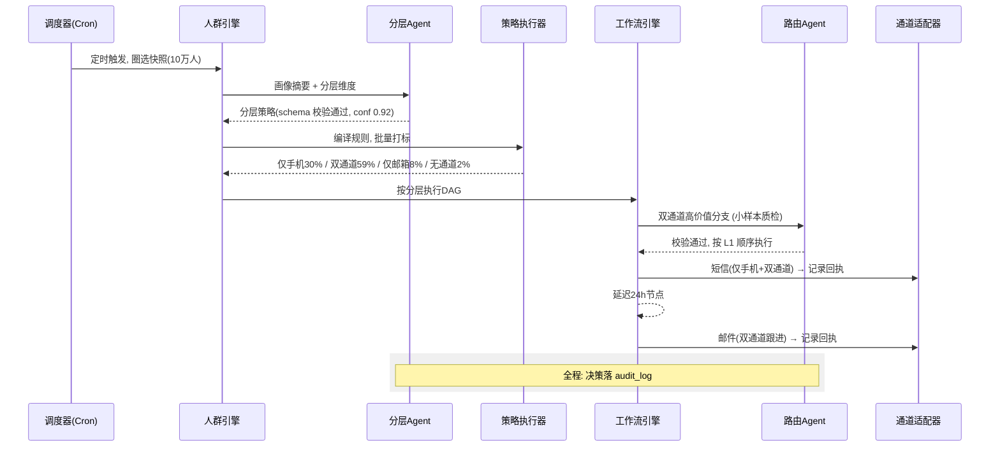
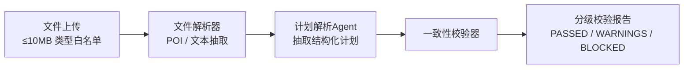
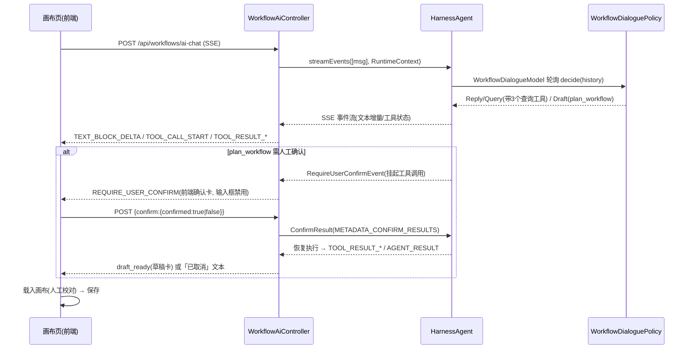

# 智能体设计（AgentScope Java 2.0）

## 1. 设计原则（四条硬线）

1. **LLM 定策略，引擎执行量**：人群可能十万级，LLM 不逐条决策、不搬运数据。智能体产出的是一份结构化分层 / 路由策略，由规则执行器批量落地。逐条 LLM 决策只用于单用户场景（事件触发）或小样本预跑。
2. **确定性兜底优先**：任何智能体调用失败 / 超时 / schema 不符 / 低置信，落到可配置的规则 fallback。核心场景（仅手机号 → 短信）本就是纯规则，不依赖 LLM —— 系统在 LLM 全挂时仍可运营。
3. **决策可审计、可回滚**：每次调用落 `audit_log`（入参摘要、输出、confidence、model、tokens、耗时、成本）。新策略 / 文案需人工审核闸门后才生效。
4. **PII 不出租户、不进模型**：传给 LLM 的是画像特征摘要（通道可用性、RFM 分、活跃度、价值分），绝不传手机号 / 邮箱 / 姓名原文。

## 2. 智能体全景

| Agent | 类型 | DAG 位置 | 决策粒度 | 模型档位 |
|---|---|---|---|---|
| 分层 Agent | 策略制定 | 人群圈选后 / 智能体分流节点 | 人群级（产出分层规则）| qwen-max（强推理）|
| 路由 Agent | 决策执行 | 智能体分流节点（单用户 / 小批量）| 用户级（逐条路由）| qwen-turbo（低延迟）|
| 流失预警 Agent | 策略分析 | 触发前预处理（M5 引入）| 人群级（风险分 ↔ 分层联动）| qwen-plus |
| 文案 Agent（可选）| 内容生成 | 动作节点的模板前置 | 模板级（生成变体 → 人工审核）| qwen-plus |
| 计划校验 Agent | 策略分析 | 发布前置（导入计划文件比对工作流）| 计划级（逐条规则比对）| qwen-plus |

## 3. 分层 Agent（核心）

**职责**：把圈定人群按运营指定的维度动态划分。核心场景即「通道可用性优先分层」：仅手机号 / 仅邮箱 / 双通道 / 无可用通道。

**输入**（人群画像摘要，非全量数据）：

```json
{
  "audience": "近30天活跃未复购",
  "size": 103420,
  "dimensions": ["channel_availability", "value_tier", "churn_risk"],
  "profile_summary": {
    "channel_availability": {"sms_only": 0.31, "email_only": 0.08, "multi": 0.59, "none": 0.02},
    "value_tier": {"high": 0.12, "mid": 0.45, "low": 0.43},
    "avg_ltv": 486.5,
    "avg_inactive_days": 12.3
  },
  "constraints": {"max_layers": 8, "min_layer_size": 1000}
}
```

**输出**（JSON Schema 强约束）：

```json
{
  "strategy_version": "2026-09-02-01",
  "layers": [
    {
      "id": "L1",
      "name": "双通道-高价值",
      "rule": {"channel_availability": "multi", "value_tier": "high"},
      "route_order": ["sms", "email"],
      "priority": 1,
      "confidence": 0.92,
      "rationale": "高价值双通道用户，短信先行保证到达，邮件次日跟进"
    }
  ],
  "fallback_rule": {"channel_availability": "sms_only", "route_order": ["sms"]},
  "auditable": true
}
```

**落地路径**：策略 → 编译为规则 → `StrategyExecutor` 批量对快照成员打分 → 分层标签写回 `contact_attribute`（如 `layer=L1`）→ 后续 DAG 分流节点按标签路由。分层结果持久化，供审计与复用。

**降级**（LLM 不可达）：租户配置的默认分层（通道优先，双通道按 DAG 顺序）直接生效，执行不中断。

## 4. 路由 Agent

**职责**：智能体分流节点内，对单个用户做通道决策 —— 结合当前时刻、最近触达史、退订 / 静默状态，微调分层规则给定的顺序。

**输入**：

```json
{
  "user": {"id": "****", "layer": "L1", "channels": ["sms", "email"]},
  "recent_touches_24h": [
    {"channel": "sms", "hours_ago": 3, "workflow": "W17"}
  ],
  "suppression": {"sms_remaining_today": 2, "in_quiet_period": false},
  "dag_intent": "promote_repurchase"
}
```

**输出**：

```json
{
  "route_order": ["email"],
  "skip": true,
  "skip_reason": "3小时前已短信触达，今日短信额度优先保留",
  "confidence": 0.88
}
```

**决策粒度规则**：事件 / API 触发的单用户流 → 逐条 LLM 决策；定时触达大批量 → 只在**小样本预跑**（≤ 200 人）用 LLM 校验分层策略，正式执行走缓存的分层标签，避免十万次 LLM 调用。

**降级**：`recent_touches_24h` 非空的用户按「已触达通道后置」的纯规则重排，其余按分层既定顺序。

## 5. 流失预警 Agent（M5 引入）

输入：用户行为序列摘要（近 30 / 90 天访问、下单、会话深度）+ 区间留存率。输出：

```json
{"churn_risk": 73, "tier": "HIGH", "drivers": ["30天未活跃", "连续2周无会话"]}
```

产出回写 `contact_attribute.churn_risk` 与分层联动（高流失人群优先触达、权重提高）。降级：规则版「N 天未活跃 = HIGH」。

## 6. AgentScope Java 2.0 集成

- **框架承载点（M6 已落地）**：主提供方逻辑以确定性 `RuleModel`（extends `ChatModelBase`）或 LLM 模型位经 `HarnessAgent` 执行，输出 JSON 由框架 native 结构化路径解析，多租户隔离由 `RuntimeContext(userId=tenantId, sessionId=action)` 承载。`HarnessAgent` 在此之上承载框架执行（模型位装配 / 会话隔离 / 超时），`AgentPolicy` 提供合规编排（硬 schema 校验 / 置信度闸门 / fallback / 审计构造）。
- **LLM 模型位（M6 延后）**：确定性 `RuleModel` 与真实 LLM 共用同一模型位，M6 接入时经 `agentscope-extensions-model-*` 注册，编排 / 审计 / 降级链路零改动。工具集（`ProfileSummaryTool` 画像摘要带租户 RLS 过滤脱敏、`TouchHistoryTool` 近 N 天触达史、`ChannelStatusTool` 通道可用性 / 配额余量）留待 LLM 里程碑注册。
- **结构化输出**：schema 语义校验由 `AgentPolicy` 承担（networknt 2.0.0 `SchemaRegistry`，实测框架 native 结构化路径只做 JSON 解析、不做 enum/required/minItems 语义校验），非法输出直接触发 fallback 分支，不进入结果分发。
- **多租户隔离**：AgentScope 2.0 原生 multi-tenant session（`RuntimeContext.userId`）与租户上下文（`TenantContext`）绑定，缺失时（纯规则执行 / 单测）兜底 `anonymous`；prompt 内禁止跨租户数据；工具调用全部经租户过滤器
- **统一执行封装**：`HarnessAgent`（框架执行）+ `AgentPolicy`（合规编排）封装「框架调用（确定性 / LLM 模型位）→ schema 校验 → 置信度阈值（< 0.7 走 fallback）→ 审计构造 → 结果分发」，Agent 业务与治理解耦。批处理 harness 单次迭代（`maxIters(1)`）+ 全工具裁剪、无状态（`disableSessionPersistence`）；超时由调用方 `AgentRunConfig.timeoutMs` 传入 `call().block()` 承担。装配期 LLM resolve 失败即确定性回退（启动不中断），运行时 LLM 故障经 `provider_error` 落入 fallback —— 两条降级路径执行均不中断、审计均落 `audit_log`

## 7. 治理清单

| 项 | 机制 |
|---|---|
| 输出可信 | JSON Schema + 置信度阈值 0.7 + 断言（分层并集 = 人群全集且不相交）|
| 失败兜底 | 超时 / 重试 2 次 → 规则 fallback，告警但不中断执行 |
| 成本 | 分层策略一次 qwen-max；逐条路由限量（租户配额）；批量走规则引擎 |
| 人工闸门 | 模板变体、新分层策略需运营审核发布；策略 `strategy_version` 可回滚 |
| 审计 | `audit_log`：入参摘要 / 输出 / schema 结果 / 置信度 / model / tokens / 耗时 / 成本 / 操作人 |
| 隐私 | 特征摘要进模型，PII 只存本地库；prompt 无手机号 / 姓名 |

## 8. 全流程时序（双通道场景）



## 9. 计划解析与校验 Agent（计划导入校验）

**职责**：运营人员在前端上传运营计划 / 规则文件（Excel / CSV / Word / PDF / Markdown），系统解析出结构化计划，与当前工作流执行配置逐条比对，判断计划中的智能触达安排是否与执行流程一致，输出分级校验报告。

**校验流水线**：



| 环节 | 方式 | 说明 |
|---|---|---|
| 文件解析器 | 确定性 | Excel/CSV 用 POI 解析为表格再文本化；Word/PDF/Markdown 抽文本；扫描版 PDF（OCR）首版不支持 |
| 计划解析 Agent | LLM (qwen-plus) | 解析出 `{trigger, audience, channels, route_order, timing, frequency, copy_notes}` |
| 一致性校验器 | 混合 | 确定性比对优先 + LLM 语义比对补充 |

**比对维度**：

| 维度 | 比对方式 | 级别示例 |
|---|---|---|
| 触发 | 确定性 | 计划 Cron / 时点 vs 工作流触发配置 |
| 通道 | 确定性 | 计划要求的通道未启用 → BLOCKED |
| 路由顺序 | 确定性 | 计划「短信→邮件」 vs DAG 出边顺序 |
| 时序 / 延迟 | 确定性 | 动作节点间隔 vs 计划时间表 |
| 频率合规 | 确定性 | 计划频率 > 租户配额 / 触碰静默期 → BLOCKED |
| 人群定义 | LLM 语义 | 计划「高价值活跃」 vs 圈选规则 |
| 文案要求 | LLM 语义 | 变量 / 签名 / 调性与模板配置 |

**校验报告输出（节选）**：

```json
{
  "plan_summary": "7天未复购促活：周一早9点短信，次日邮件跟进",
  "dimensions": [
    {
      "name": "channel",
      "level": "BLOCKED",
      "plan": "双通道：短信 + 微信",
      "workflow": "仅启用：sms, email",
      "detail": "计划要求微信通道，当前通道配置未启用且未接入",
      "suggestion": "调整计划移除微信通道，或启用微信通道配置"
    }
  ],
  "summary": {"conflicts": 1, "warnings": 2, "passed": 5},
  "decision": "BLOCKED"
}
```

**发布闸门**：`decision=BLOCKED` 阻止发布（需调整计划或工作流）；`WARNINGS` 可发布但展示警告；强制发布需审批并留审计。

**安全与治理**：上传文件是外部输入 —— 类型白名单 + 大小限制 + 文件内容只作文本数据（不进提示词指令区），输出仍受 schema 校验，防提示词注入；报告持久化（`validation_report`）可回看；解析与比对全程落 `audit_log`。

**降级**：LLM 解析失败 → 提示文件格式问题或退回纯确定性解析（Excel 结构化列直接映射）；LLM 不可达不阻断发布，仅降级为确定性校验。

## 10. 工作流对话创建 + HITL 确认（AI 创建）

**职责**：运营人员在画布页发起对话式创建，AI 逐项查询通道 / 模板 / 人群并与用户确认后生成工作流 DAG 草稿，前端载入画布人工校对后保存。生成不自动落库、人群不自动创建（未匹配仅提示）。

**承载**：`HarnessAgent`（name=workflow-dialogue）+ 确定性 `WorkflowDialogueModel`（无 LLM 可跑；模型位接入任何 LLM 同构零改动，HITL 是框架级能力）。



**策略决策**（WorkflowDialoguePolicy，确定性规则，分支顺序）：

1. 末词命中取消词 → 回复「已取消，可继续补充需求」；
2. 需求文本画像齐备（触发显式 + 人群已表达）→ Draft（plan_workflow）；
3. 缺触发只追问触发；缺人群引用已检索人群前 5 名；均缺先跑 3 个查询工具。

**HITL 确认闸门**：模型输出 `ToolUseBlock(plan_workflow)` → 框架 `checkPermissions` 返回 ASK → `RequireUserConfirmEvent`；controller 缓存原工具调用块（session 维度 pendingAsks），确认消息走 `Msg` 元数据通道（不落对话上下文），恢复执行不重走模型输出工具。挂起期间前端禁输入框，后端对未确认消息返回 400 防御。

**SSE 事件语义**：统一 `{type: AgentEventType.name()}`（大写枚举名），关键事件：`TEXT_BLOCK_DELTA`（打字机增量）、`TOOL_CALL_START` / `TOOL_RESULT_TEXT_DELTA` / `TOOL_RESULT_END`（工具行状态）、`REQUIRE_USER_CONFIRM`（确认卡）、`USER_CONFIRM_RESULT`（清除确认态；拒绝时前端回标挂起工具行「已取消」）、`AGENT_RESULT`（结语）、自定义 `draft_ready`（后端从 plan_workflow 工具输出增量重建草稿 JSON）。

**数据流与安全**：租户上下文 `TenantContext` 为 ThreadLocal，工具线程经 `RuntimeContext` 类型化属性注入（`withTenant + Mono.defer`）；对话会话状态第一版用 JsonFileAgentStateStore（生产可切 agentscope-extensions-redis 的 RedisAgentStateStore）；工作流草稿不落库，人工保存走既有审计。