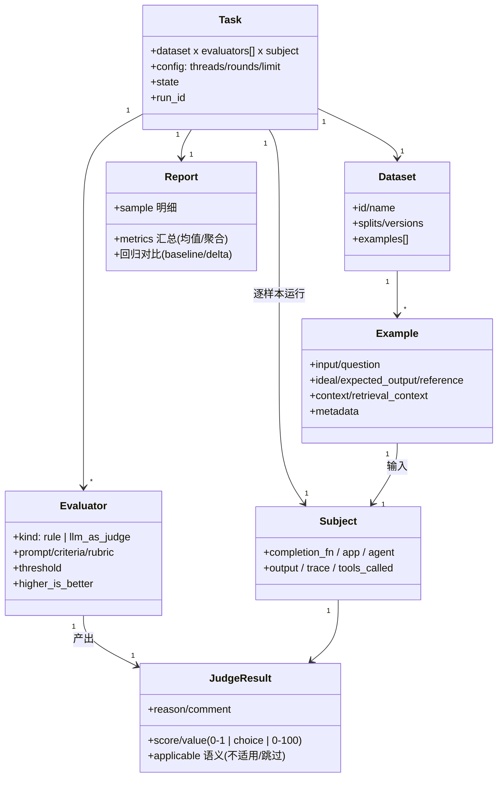
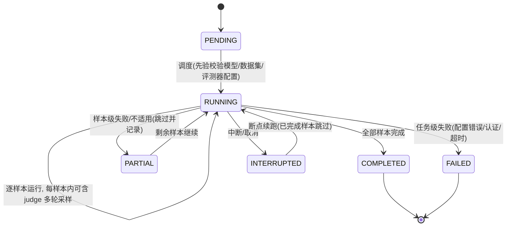

# 99 LLM 评测中心行业基准调研报告

> 目的：为 ea-sys（Java 21 / Spring Boot 3）评测中心从零重构提供行业参照。本文所有结论均来自下文标注 URL 的已抓取页面原文，未抓到的内容一律不写。抓取失败的 URL 与替代方案见文末附录。
> 调研对象：OpenAI Evals、LangSmith、Ragas、DeepEval、国内 EvalScope（ModelScope）。抓取时间 2026-09-04。

---

## 一、共性领域模型

### 1.1 实体关系

五个框架虽然实现各异，但抽象出的领域模型高度一致，可归纳为「数据集 — 样本 — 评测器 — 被测对象 — 任务 — 报告」六元组：

| 实体 | OpenAI Evals | LangSmith | Ragas | DeepEval | EvalScope |
|---|---|---|---|---|---|
| 数据集 | registry + JSONL（命名 `<eval_name>.<split>.<version>`） | Dataset（examples 集合，splits/versions） | dataset 抽象 | EvaluationDataset（goldens 集合，单轮/多轮强制类型） | 数据集目录（内置 benchmark + custom_dataset） |
| 样本 | 每行一个 JSON（`input` 必填，`ideal` 参考） | Example = {inputs, reference outputs?, metadata} | SingleTurnSample / MultiTurnSample | Golden（评测期才转 LLMTestCase） | 样本/题库条目（支持 `--limit` 裁剪） |
| 评测器 | Eval 基类（eval_sample / run），registry yaml 注册 | Evaluator（输入 Example+Run，输出 feedback） | Metric / MetricWithLLM | Metric（G-Eval/DAG/规则等 50+） | Native 后端评测器 + 多后端（OpenCompass/VLMEvalKit/RAGEval） |
| 被测对象 | CompletionFn（模型位） | 被测应用（traced app，含 tools/metadata） | 被测 LLM 系统 | 用户自己的 LLM 应用（调 generate 产生 actual_output） | 被测模型（本地/OpenAI 兼容 API） |
| 任务 | RunSpec（completion_fns/eval_name/split/run_config/run_id/created_at） | Experiment（数据集 × 应用版本），离线/在线两种 | 评测运行 | evaluate() / `deepeval test run` / dataset.evals_iterator() | TaskConfig（model/datasets/generation-config/limit）→ run_task |
| 报告 | metrics dict（首指标为主指标）+ JSONL 事件日志 | 实验表（均分/标准差/成本列/回归 delta） | 指标打分结果 | 0-1 分数 + reason + threshold 判定 | 终端报告表（Model/Dataset/Metric/Subset/Num/Score）+ Web Dashboard |



证据：OpenAI [base.py](https://raw.githubusercontent.com/openai/evals/main/evals/base.py)（BaseEvalSpec 含 id/metrics/higher_is_better；RunSpec 字段）、[build-eval.md](https://raw.githubusercontent.com/openai/evals/main/docs/build-eval.md)（JSONL 格式与 `<name>.<split>.<version>` 命名）、LangSmith [evaluation-concepts](https://docs.langchain.com/langsmith/evaluation-concepts)（Dataset/Example/Experiment/Evaluator→feedback、离线 vs 在线）、Ragas [metrics overview](https://docs.ragas.io/en/stable/concepts/metrics/overview/)（Metric/MetricWithLLM、单轮/多轮）、DeepEval [evaluation-datasets](https://deepeval.com/docs/evaluation-datasets)（Dataset=goldens、Golden→LLMTestCase）、[evaluation-end-to-end-llm-evals](https://deepeval.com/docs/evaluation-end-to-end-llm-evals)(LLMTestCase 字段)、EvalScope [README](https://github.com/modelscope/evalscope) 与 [basic_usage](https://evalscope.readthedocs.io/en/latest/get_started/basic_usage.html)（TaskConfig/run_task/报告表）。

### 1.2 任务状态机



状态机依据：

- **样本级粒度**：OpenAI `eval_all_samples` 批量循环，单样本异常不中断整批（[custom-eval.md](https://raw.githubusercontent.com/openai/evals/main/docs/custom-eval.md)）；LangSmith 实验进度条实时反映「run + eval 双重状态」（[analyze-an-experiment](https://docs.langchain.com/langsmith/analyze-an-experiment)）。
- **断点续跑**：OpenAI `oaievalset` 写 `.progress.txt` 进度文件可续跑，单个 eval 不可中途恢复（[run-evals.md](https://raw.githubusercontent.com/openai/evals/main/docs/run-evals.md)）；EvalScope v1.11.0 明确「improved … incomplete-run handling」（[README](https://github.com/modelscope/evalscope)）。
- **任务级配置**：EvalScope `--limit` 快速验证、`TaskConfig` 先验校验（[basic_usage](https://evalscope.readthedocs.io/en/latest/get_started/basic_usage.html)）。

---

## 二、主流评测项清单表

「判定类型」列：rule=确定性规则；llm=LLM-as-judge；embed=嵌入相似度；hybrid=LLM+规则混合。

| 类别 | 评测项 | 算法/判法 | 适用场景 | 来源 |
|---|---|---|---|---|
| 字符串基础(rule) | Match | `any([a.startswith(b) for b in B])`，output A 以任一 ideal B 开头 | 单值输出/分类 | [eval-templates.md](https://raw.githubusercontent.com/openai/evals/main/docs/eval-templates.md) |
| 字符串基础(rule) | Includes | `any([b in a for b in B])`，ideal 是 output 的子串 | 关键词/子串校验 | 同上 |
| 字符串基础(rule) | FuzzyMatch | `any([a in b or b in a for b in B])` 双向包含 | 宽松匹配 | 同上 |
| 字符串基础(rule) | JsonMatch | 键值完全一致比较 | 结构化 JSON 输出 | 同上 |
| 字符串比较(rule) | Exact Match / String Presence / String Similarity / BLEU / CHRF / ROUGE | 确定性字符串比对或统计相似度，文档明示「与人工相关性低」 | 确定性可复现场景 | [Ragas available_metrics](https://docs.ragas.io/en/stable/concepts/metrics/available_metrics/)、[overview](https://docs.ragas.io/en/stable/concepts/metrics/overview/) |
| 数值准确性(rule) | Accuracy（如 GSM8K/ARC） | 答案抽取 + 与标准答案判等，报告列 `Accuracy ↑`，`Num` 为样本数 | 数理/选择类 | [EvalScope basic_usage](https://evalscope.readthedocs.io/en/latest/get_started/basic_usage.html) |
| 相关性(embed/llm) | Answer Relevancy | 由回答反推 N 个问题（默认 3），与原问题做嵌入余弦相似度取均值；**不评判事实正确性** | 回答是否贴合提问，无需参考 | [Ragas answer_relevance](https://docs.ragas.io/en/stable/concepts/metrics/available_metrics/answer_relevance/) |
| 事实一致性(hybrid) | Faithfulness | 拆出回答中全部 claims，逐条判能否由检索上下文推出：支持 claims / 总 claims | RAG 忠实性（以检索上下文为真值） | [Ragas faithfulness](https://docs.ragas.io/en/stable/concepts/metrics/available_metrics/faithfulness/) |
| 幻觉(hybrid) | Hallucination | LLM 逐 context 判与 actual_output 是否矛盾：对齐的 contexts / 总 contexts；`threshold` 默认 0.5 | 有 curated ground-truth context（生成器侧） | [DeepEval metrics-hallucination](https://deepeval.com/docs/metrics-hallucination) |
| 检索质量(hybrid) | Context Precision | 对检索结果逐 rank 算 Precision@k，再按相关项位置加权取均值；相关项越靠前分越高 | 检索排序质量，有/无参考两种变体 | [Ragas context_precision](https://docs.ragas.io/en/stable/concepts/metrics/available_metrics/context_precision/) |
| 检索质量(hybrid) | Context Recall | 参考答案拆成 claims，判被检索上下文覆盖比例 | 检索召回（别漏关键信息） | [Ragas context_recall](https://docs.ragas.io/en/stable/concepts/metrics/available_metrics/context_recall/) |
| 检索质量(llm) | Context Entities Recall / Noise Sensitivity | 实体覆盖度 / 上下文噪声（信噪）判定 | 检索、上下文精简、信噪评估 | [Ragas available_metrics](https://docs.ragas.io/en/stable/concepts/metrics/available_metrics/) |
| 事实正确性(llm) | Factual Correctness | LLM 对照 reference 逐事实点判定（NL 比较组） | 问答准确性 | 同上 |
| LLM-judge 通用(llm) | G-Eval | 日常语言 `criteria` + 可选 `evaluation_steps` + 可选 `rubric`（0-10 分段：如 0-2 事实错误/3-6 大体正确/7-9 缺细节/10 完全正确）→ 0-1 分 + reason | 细粒度自定义评分 | [DeepEval metrics-llm-evals](https://deepeval.com/docs/metrics-llm-evals) |
| LLM-judge 通用(llm) | model-graded（choice） | `choice_strings` + `choice_scores` 映射；`eval_type: cot_classify`（先推理后作答，答案置于末尾便于解析）；fact 模板返回 A 子集/B 超集/C 全同/D 冲突/E 无关差异 | 分类/多选/事实判定 | [eval-templates.md](https://raw.githubusercontent.com/openai/evals/main/docs/eval-templates.md)、[fact.yaml](https://raw.githubusercontent.com/openai/evals/main/evals/registry/modelgraded/fact.yaml) |
| LLM-judge 通用(llm) | Rubrics / Aspect Critic / Simple Criteria Scoring | 「评分标准即 prompt（rubric）+ 结构化输出」；LangSmith 自定义 rubric 即写 prompt，feedback 支持 Boolean/Categorical/Continuous 三种类型 | 自定义规则化评分 | [Ragas available_metrics](https://docs.ragas.io/en/stable/concepts/metrics/available_metrics/)、[LangSmith llm-as-judge](https://docs.langchain.com/langsmith/llm-as-judge) |
| 对比评测(llm) | Pairwise / Arena / Battle | 两模型输出对决打分 → 胜率 + 置信区间（CI），如 EvalScope 表格 WinRate + CI | 多模型横向对比 | [EvalScope README](https://github.com/modelscope/evalscope)（Arena Mode 段落） |
| Agent 轨迹(hybrid) | Tool Call Accuracy / Tool Call F1 / Agent Goal Accuracy / Topic adherence | 轨迹级判定工具调用与目标达成 | Agent 工具调用 | [Ragas available_metrics](https://docs.ragas.io/en/stable/concepts/metrics/available_metrics/) |
| Agent 轨迹(llm) | Task Completion / Step Efficiency / Plan Adherence / Plan Quality / Tool、Argument Correctness | 基于 tracing 的轨迹级 LLM 判定 | Agent 任务执行/步骤效率（对应 ea-sys execute 模式轨迹） | [DeepEval metrics-introduction](https://deepeval.com/docs/metrics-introduction) |
| 安全(llm) | Bias / Toxicity / PII Leakage 等 | LLM 判定 | 内容合规审计 | 同上 |
| 多轮(llm) | Conversation Relevancy（Turn Relevancy）/ 多轮 metric | 跨轮场景判定；DeepEval ConversationalTestCase 强制多轮数据集类型 | 对话系统 | [DeepEval evaluation-datasets](https://deepeval.com/docs/evaluation-datasets)、[metrics-introduction](https://deepeval.com/docs/metrics-introduction) |
| SQL(llm/rule) | 执行类 / 等价类 | 执行结果比对或 SQL 等价判定 | 文本转 SQL | [Ragas available_metrics](https://docs.ragas.io/en/stable/concepts/metrics/available_metrics/) |
| 通用判定(rule) | threshold pass/fail | `score ≥ threshold` 通过（DeepEval 默认 0.5；`strict_mode` 强制二元且 threshold=1；`flaky` 标记不稳定指标） | 所有指标统一出口 | [DeepEval metrics-introduction](https://deepeval.com/docs/metrics-introduction)、[metrics-hallucination](https://deepeval.com/docs/metrics-hallucination) |

选型共识（[Ragas overview](https://docs.ragas.io/en/stable/concepts/metrics/overview/)）：LLM 类指标非确定性但更接近人工；规则类是确定性的但与人工相关性低；端到端优先、少而强的信号；评分范围统一归一化 0-1。

---

## 三、判分机制

### 3.1 LLM-as-judge 提示词要点

- **Prompt 即 rubric**：DeepEval G-Eval 的 `criteria` 用日常语言定义评分标准，可选 `evaluation_steps`（不提供则由 LLM 依据 criteria 自生成步骤），`evaluation_params` 只放 criteria 涉及的参数（[metrics-llm-evals](https://deepeval.com/docs/metrics-llm-evals)）；LangSmith 自定义 judge 的 rubric 就是 prompt 本身，通过 `{{prompt_var}}` 把输入/输出/参考映射进模板，few-shot 示例由人工纠错自动插入（[llm-as-judge](https://docs.langchain.com/langsmith/llm-as-judge)）。
- **数据块结构化**：OpenAI model-graded 模板把 `[Question]`、`[Expert]`（权威答案，可选）、`[Submission]`（被评输出）组织为独立数据块（[fact.yaml](https://raw.githubusercontent.com/openai/evals/main/evals/registry/modelgraded/fact.yaml)）。
- **先推理后作答**：`eval_type: cot_classify`（推荐）先让 judge 推理再给结论且「答案位于末尾」便于解析；`classify_cot`、`classify` 为变体；`output_template` 约束输出结构（[eval-templates.md](https://raw.githubusercontent.com/openai/evals/main/docs/eval-templates.md)）。
- **结构化输出约束**：LangSmith 把 feedback 配置（类型+取值域）作为 structured output schema 追加进 prompt，约束 LLM 输出合法 feedback（[llm-as-judge](https://docs.langchain.com/langsmith/llm-as-judge)）。

### 3.2 评分尺度与理由输出

- DeepEval 全部指标输出 **0-1 分数 + `reason` 理由**（`include_reason` 默认 true），`metric.score` / `metric.reason` 可直接取（[metrics-introduction](https://deepeval.com/docs/metrics-introduction)、[metrics-hallucination](https://deepeval.com/docs/metrics-hallucination)）。
- OpenAI choice 制：`choice_strings`（候选答案）+ `choice_scores`（分值映射），评分=模型选中的 choice 对应分（[eval-templates.md](https://raw.githubusercontent.com/openai/evals/main/docs/eval-templates.md)）。
- LangSmith Evaluator 输出 feedback 结构 `{key, score|value, comment}`，score 数值型或 value 布尔/类别型（[evaluation-concepts](https://docs.langchain.com/langsmith/evaluation-concepts)）。
- 分段 rubric 示例：0-2 事实错误 / 3-6 大体正确 / 7-9 缺少细节 / 10 完全正确，由 rubric 文本约束评分粒度（[metrics-llm-evals](https://deepeval.com/docs/metrics-llm-evals)）。

### 3.3 多次采样聚合（降噪）

- LangSmith：`evaluate(..., num_repetitions=N)` 每个样本跑 N 次，5 样本 × 5 = 25 runs；实验表显示**均值**，点击可见单次分数与**标准差 std dev**（[repetition](https://docs.langchain.com/langsmith/repetition)）。
- EvalScope：`--repeats k` 指定多次生成，聚合方式可配 `mean_and_vote_at_k`、`mean_and_pass_at_k`、`mean_and_pass^k`（[basic_usage](https://evalscope.readthedocs.io/en/latest/get_started/basic_usage.html)）。
- OpenAI Evals 默认单次运行（无重复采样概念），确定性由其规则模板保证。

### 3.4 规则类算法要点

- 集合判等系：Match/Includes/FuzzyMatch/JsonMatch 的判定公式见第二章表（[eval-templates.md](https://raw.githubusercontent.com/openai/evals/main/docs/eval-templates.md)）。
- 计数-比例系：Ragas Faithfulness = 上下文支持的 claims / 总 claims（[faithfulness](https://docs.ragas.io/en/stable/concepts/metrics/available_metrics/faithfulness/)）；Context Recall 同构（reference claims 被覆盖比例，[context_recall](https://docs.ragas.io/en/stable/concepts/metrics/available_metrics/context_recall/)）；Context Precision 为带位置权重的 Precision@k 均值（[context_precision](https://docs.ragas.io/en/stable/concepts/metrics/available_metrics/context_precision/)）。
- 嵌入相似系：Ragas Answer Relevancy = 逆推问题与原问题的余弦均值（[answer_relevance](https://docs.ragas.io/en/stable/concepts/metrics/available_metrics/answer_relevance/)）；DeepEval/Semantic 类同属此类（overview 的 Non-LLM based metrics 说明其确定性本质）。
- 规则判定注意点：DeepEval 提示 rule metrics「别用于答案不唯一/语义开放的任务」，且与人工相关性低（[metrics-introduction](https://deepeval.com/docs/metrics-introduction)）。

### 3.5 判定输出与校准

- 不适用/跳过语义：ea-sys 的「actual_response 空=不适用不计均值」在业界有对应实践 —— DeepEval 中 rule metric 输入不满足即无法 measure（需显式构造）；LangSmith 的 feedback `value` 类型可表达非数值判定（[evaluation-concepts](https://docs.langchain.com/langsmith/evaluation-concepts)）。
- 阈值与稳定性：DeepEval `threshold`（默认 0.5）、`strict_mode`（二元 1/0、threshold 强制 1）、`flaky`（标记不稳定指标，观测而非硬失败）（[metrics-introduction](https://deepeval.com/docs/metrics-introduction)）。
- judge 校准回流：LangSmith 的人工纠错 few-shot 自动进 prompt（[llm-as-judge](https://docs.langchain.com/langsmith/llm-as-judge)）；Ragas 设计原则含 few-shot 增强 LLM 指标鲁棒性（[overview](https://docs.ragas.io/en/stable/concepts/metrics/overview/)）。

---

## 四、运行与报告

### 4.1 运行方式与并发

- OpenAI：CLI `oaieval`（单 eval）/ `oaievalset`（批量）；默认 **10 线程**并行，`EVALS_THREADS` / `EVALS_THREAD_TIMEOUT` 可配（[run-evals.md](https://raw.githubusercontent.com/openai/evals/main/docs/run-evals.md)）。
- LangSmith：`evaluate()` 跑一个 experiment，per-example 生成 run + 逐例判分，进度条实时（run 与 eval 双状态）（[evaluation-concepts](https://docs.langchain.com/langsmith/evaluation-concepts)、[analyze-an-experiment](https://docs.langchain.com/langsmith/analyze-an-experiment)）。
- DeepEval：两条路径 —— `evaluate(test_cases, metrics)` 自包含脚本（适合一次性），`dataset.evals_iterator()` + tracing（推荐，每测试用例自动关联 trace 并复用至组件级），CI/CD 用 `deepeval test run`（[evaluation-end-to-end-llm-evals](https://deepeval.com/docs/evaluation-end-to-end-llm-evals)、[evaluation-datasets](https://deepeval.com/docs/evaluation-datasets)）。
- EvalScope：`evalscope eval` CLI / `run_task(TaskConfig)` / yaml、json 配置；`--limit N` 快速验证，`--repeats k` 多次生成（[basic_usage](https://evalscope.readthedocs.io/en/latest/get_started/basic_usage.html)）。

### 4.2 进度与恢复

- 断点续跑：OpenAI `oaievalset` 写 `.progress.txt`，重跑跳过已完成（[run-evals.md](https://raw.githubusercontent.com/openai/evals/main/docs/run-evals.md)）；EvalScope v1.11.0「incomplete-run handling」（[README](https://github.com/modelscope/evalscope)）。
- 实时进度：LangSmith 实验页进度条跟踪 run 与 eval 状态（[analyze-an-experiment](https://docs.langchain.com/langsmith/analyze-an-experiment)）。
- 样本级记录：OpenAI 全程 JSONL 事件日志（每个样本的运行/判分事件可复原）（[run-evals.md](https://raw.githubusercontent.com/openai/evals/main/docs/run-evals.md)）。

### 4.3 失败策略

- 样本级容错：单样本判分失败不中断整批（OpenAI `eval_all_samples`，[custom-eval.md](https://raw.githubusercontent.com/openai/evals/main/docs/custom-eval.md)）；LangSmith 可筛选 status=success/error 的 runs（[compare-experiment-results](https://docs.langchain.com/langsmith/compare-experiment-results)）。
- 稳定性标记：DeepEval `flaky` 标记不稳定指标；规则/metric 输入不满足不产出分数（[metrics-introduction](https://deepeval.com/docs/metrics-introduction)）。
- 报告语义：指标只统计适用样本（ea-sys 现状一致），EvalScope 报告表明确 `Num`（样本数）列（[basic_usage](https://evalscope.readthedocs.io/en/latest/get_started/basic_usage.html)）。

### 4.4 指标汇总与回归对比

- 主指标：OpenAI 注册 yaml 的 `metrics` 列表首个为主指标（[build-eval.md](https://raw.githubusercontent.com/openai/evals/main/docs/build-eval.md)）；指标方向 `higher_is_better`（[base.py](https://raw.githubusercontent.com/openai/evals/main/evals/base.py)）；LangSmith 对比视图可逐 feedback key 配置「higher is better」（[compare-experiment-results](https://docs.langchain.com/langsmith/compare-experiment-results)）。
- 聚合：EvalScope `mean_and_vote_at_k` / `mean_and_pass_at_k`；LangSmith 重复实验显示均值 + 标准差（[repetition](https://docs.langchain.com/langsmith/repetition)）；Ragas 输出类型 Discrete/Numeric/Ranking，numeric 支持 mean/sum/mode 聚合（[overview](https://docs.ragas.io/en/stable/concepts/metrics/overview/)）。
- 回归对比：LangSmith 对比视图红色标记相对 source experiment 的**回归**、绿色标记**改进**，列头显示更好/更差 run 数；可设 baseline 后显示各实验与基准的分差 delta；支持 CSV 导出、按 metadata（models/prompts/tools）分组过滤（[compare-experiment-results](https://docs.langchain.com/langsmith/compare-experiment-results)、[analyze-an-experiment](https://docs.langchain.com/langsmith/analyze-an-experiment)）。
- 多模型对比：EvalScope Dashboard 多模型对比 + Arena 胜率表（WinRate + CI）（[README](https://github.com/modelscope/evalscope)）。

### 4.5 可观测与成本

- LangSmith 实验列含 latency / tokens / cost 等明细列，实验视图可联动 traces（[analyze-an-experiment](https://docs.langchain.com/langsmith/analyze-an-experiment)）。
- DeepEval tracing：`@observe` 包裹组件，`update_current_span(test_case=...)` 使每个测试用例获得完整 trace 视图（[metrics-hallucination](https://deepeval.com/docs/metrics-hallucination)「Within components」段、[evaluation-end-to-end-llm-evals](https://deepeval.com/docs/evaluation-end-to-end-llm-evals)）。
- EvalScope：Agent 评测记录 per-sample `agent_trace` 可在 Dashboard Predictions 逐步回放；结构化报告支持 JSON/Table/Logs + Web Dashboard + wandb/swanlab（[README](https://github.com/modelscope/evalscope)）。

---

## 五、对 ea-sys 评测中心重构的差距清单

### 5.0 现状基线（以 `docs/98-existing-eval-map.md` 与任务要求为准）

已有且与业界对齐：双链路（execute=question→Agent→输出→判分，openjudge=预置 response 跳过 Agent）；规则评测器（keyword_contains/regex_match/length_between 等）+ LLM-Judge 6 项 + 自定义 judge 提示词；jsonl 导入；judgeRounds 1-5 多轮取均值；TraceID 与驾驶舱联动。**主要结构性差距：`run()` 是同步 `@Transactional` 全量执行（前端 `timeout:0` 等待）、LLM 判分靠正则 `\b\d{1,3}\b` 解析 0-100、无报告对比/基线、数据集编辑即生效无版本、报告无成本/延迟聚合。**

### 5.1 高价值差距（重构核心）

| # | 差距项 | 现状 | 业界证据 | 建议落地 |
|---|---|---|---|---|
| H1 | **任务实体化 + 异步化 + 样本级进度 + 断点续跑** | run() 同步、全部样本一批跑完，无任务表/进度 | OpenAI `.progress.txt` 续跑（[run-evals](https://raw.githubusercontent.com/openai/evals/main/docs/run-evals.md)）；EvalScope incomplete-run handling + `--limit`（[README](https://github.com/modelscope/evalscope)、[basic_usage](https://evalscope.readthedocs.io/en/latest/get_started/basic_usage.html)）；LangSmith run+eval 双进度（[analyze-an-experiment](https://docs.langchain.com/langsmith/analyze-an-experiment)） | 新增评测任务表（状态机见 1.2）+ 异步执行 + 逐样本状态/进度上报 + 失败样本记录可重跑 |
| H2 | **LLM-judge 结构化输出 + 理由落库** | 正则解析 0-100，无 reason | DeepEval 0-1+reason、include_reason（[metrics-introduction](https://deepeval.com/docs/metrics-introduction)）；LangSmith feedback {key, score, comment} + structured output 约束（[llm-as-judge](https://docs.langchain.com/langsmith/llm-as-judge)、[evaluation-concepts](https://docs.langchain.com/langsmith/evaluation-concepts)）；OpenAI choice/output_template（[eval-templates](https://raw.githubusercontent.com/openai/evals/main/docs/eval-templates.md)） | judge 提示词要求输出 JSON {score, reason}（或 choice 集合），解析容错+理由存报告，替代正则 |
| H3 | **评分口径统一 0-1 + threshold/不适用语义** | LLM 判分 0-100 与规则 0-1 混用，通过线 0.8 硬编码 | DeepEval 全指标 0-1、threshold 默认 0.5、strict_mode、flaky（[metrics-introduction](https://deepeval.com/docs/metrics-introduction)）；Ragas 0-1 归一化原则（[overview](https://docs.ragas.io/en/stable/concepts/metrics/overview/)） | 统一 0-1 归一化，每评测项可配 threshold/方向/不适用判定 |
| H4 | **报告回归对比 + baseline** | 报告列表无跨次对比 | LangSmith baseline+delta、红绿回归视图、设 source experiment（[compare-experiment-results](https://docs.langchain.com/langsmith/compare-experiment-results)、[analyze-an-experiment](https://docs.langchain.com/langsmith/analyze-an-experiment)）；EvalScope Dashboard 多模型对比（[README](https://github.com/modelscope/evalscope)） | 报告详情/列表支持「以某次报告为基准」对比 delta 与逐样本红绿 |
| H5 | **数据集版本化 + splits** | 数据集编辑即生效，无快照/分割 | OpenAI `<name>.<split>.<version>`、改数据需 bump 版本（[build-eval](https://raw.githubusercontent.com/openai/evals/main/docs/build-eval.md)）；LangSmith 数据集 versions/splits（[evaluation-concepts](https://docs.langchain.com/langsmith/evaluation-concepts)）；EvalScope v1.11 published evaluation versions（[README](https://github.com/modelscope/evalscope)） | 数据集发布版本快照；样本支持训练/评测分割标注（供 H4 对比口径一致） |
| H6 | **指标方向元数据 higher_is_better** | 全部默认越高越好 | OpenAI BaseEvalSpec.higher_is_better（[base.py](https://raw.githubusercontent.com/openai/evals/main/evals/base.py)）；LangSmith 逐 feedback key 配置（[compare-experiment-results](https://docs.langchain.com/langsmith/compare-experiment-results)） | 评测项注册表加方向/单位/聚合方式元数据 |
| H7 | **Python 脚本自定义评测器规范化** | 目标已含 Python 脚本入口，但无执行约束 | OpenAI 自定义 Eval 基类（继承+覆写 eval_sample/run，返回 metrics dict）（[custom-eval](https://raw.githubusercontent.com/openai/evals/main/docs/custom-eval.md)）；EvalScope 仓库含 `advanced_guides/sandbox.md`（沙箱支撑，见仓库文件列表）；DeepEval 100% 自定义指标（[metrics-introduction](https://deepeval.com/docs/metrics-introduction)） | 脚本评测器约定「输入样本 JSON → 输出 {score, reason}」schema、超时/资源限制、结果校验 |

### 5.2 中价值差距（增强项）

| # | 差距项 | 业界证据 | 说明 |
|---|---|---|---|
| M1 | **多次采样一致性度量** | LangSmith 均值+std dev（[repetition](https://docs.langchain.com/langsmith/repetition)）；EvalScope `--repeats` 聚合 mean_and_vote_at_k/pass@k（[basic_usage](https://evalscope.readthedocs.io/en/latest/get_started/basic_usage.html)） | judgeRounds 均值已有，补标准差展示与 vote/pass@k 聚合选项 |
| M2 | **在线/离线双层评测 + CI 化** | LangSmith 在线评测/生产监控（[evaluation-concepts](https://docs.langchain.com/langsmith/evaluation-concepts)）；DeepEval `deepeval test run` + pytest 断言（[evaluation-datasets](https://deepeval.com/docs/evaluation-datasets)） | 先做离线层；在线监控依赖驾驶舱流量，可后置 |
| M3 | **few-shot 人工纠错回流** | LangSmith 纠错自动插入 prompt（[llm-as-judge](https://docs.langchain.com/langsmith/llm-as-judge)）；Ragas few-shot 增强鲁棒性（[overview](https://docs.ragas.io/en/stable/concepts/metrics/overview/)） | 报告详情里人工改判 → 进入 judge prompt 示例库 |
| M4 | **Pairwise/Arena 对比评测** | OpenAI battle 模板（[eval-templates](https://raw.githubusercontent.com/openai/evals/main/docs/eval-templates.md)）；EvalScope Arena WinRate+CI（[README](https://github.com/modelscope/evalscope)） | 两模型位输出对比判分，支持选型 |
| M5 | **成本/令牌/耗时聚合列** | LangSmith 实验列 latency/tokens/cost（[analyze-an-experiment](https://docs.langchain.com/langsmith/analyze-an-experiment)） | llm_usage 已有数据，报告/任务汇总展示即可 |
| M6 | **生产流量回流建数据集** | LangSmith 生产 trace 转化数据集、合成数据（[evaluation-concepts](https://docs.langchain.com/langsmith/evaluation-concepts)）；DeepEval Golden Synthesizer；Ragas Test Data Generation（[overview](https://docs.ragas.io/en/stable/concepts/metrics/overview/) 导航） | 把线上运营会话导出为评测样本（与驾驶舱数据联动） |

### 5.3 低价值差距（暂不做）

| # | 差距项 | 业界证据 | 原因 |
|---|---|---|---|
| L1 | RAG 检索类指标（Context Precision/Recall/Entities/Noise） | [Ragas available_metrics](https://docs.ragas.io/en/stable/concepts/metrics/available_metrics/) | ea-sys 触达链路无检索模块，无 retrieved_context 输入 |
| L2 | 安全/偏见/毒性/PII 指标 | [DeepEval metrics-introduction](https://deepeval.com/docs/metrics-introduction)（SAFETY 组） | 内部运营工具，回归/正确性优先 |
| L3 | 多模态（VLM/图像/视频）评测 | [EvalScope README](https://github.com/modelscope/evalscope)（VLM 支持） | 纯文本触达场景 |
| L4 | 推理性能压测（TTFT/TPOT） | [EvalScope README](https://github.com/modelscope/evalscope)（Inference Performance Testing） | 属性能工程非评测中心 |
| L5 | 公共 benchmark 注册表（MMLU/C-Eval/GSM8K 等） | [EvalScope README](https://github.com/modelscope/evalscope)（内置 benchmarks）；OpenAI registry | 业务自带数据集（jsonl），公共题集优先级低 |

### 5.4 目标评测项与业界映射（供重构时选型）

- 规则类：`string_exact`→Exact Match/String Presence；`text_similarity`→String Similarity/Semantic Similarity（BOW/RAG 图）；`number_accuracy`→EvalScope Accuracy 判等系；`response_repetition`→无同名指标，业界用字符串/语义相似度判定重复（Ragas NL 组）；`observation_information_gain`→无同名指标，最接近的是 Ragas Noise Sensitivity（上下文信息增量/信噪视角），需自研公式（均不能照搬）。
- LLM 类 6 项：`llm_correctness`→Factual Correctness；`llm_instruction_following`→G-Eval criteria 型；`llm_relevance`→Answer Relevancy（无参考时）/ rubric；`llm_hallucination`→DeepEval Hallucination（context 对齐计数式，判分输入需注入 context）；`llm_reasoning_groundedness`→Ragas Faithfulness（claims 支持计数式）；`llm_response_completeness`→G-Eval rubric 分段（如 7-9 缺失细节/10 完整）。
- 双链路：execute=DeepEval `evaluate()` 黑盒（golden→调应用→判分）与 OpenAI CompletionFn；openjudge=DeepEval 预置 actual_output 直判（goldens 已含输出）。jsonl 数据集管理=OpenAI/DeepEval jsonl 均同构（每行一对象，input/question 必填）。

---

## 附录：抓取失败与替代记录

| 目标 | 结果 | 替代 |
|---|---|---|
| https://docs.smith.langchain.com/evaluation | 未抓（域名迁移） | docs.langchain.com 同源页面已抓（evaluation-concepts 等） |
| https://github.com/openai/evals/blob/main/docs/getting-started.md | 404，仓库无此文件 | build-eval.md 替代 |
| openai/evals registry 数据 jsonl（LFS） | raw 返回 LFS 指针非内容 | build-eval.md 文字描述格式，不再抓 |
| https://help.aliyun.com/zh/model-studio/evaluation-introduction | 404 | 放弃；国内方案以 EvalScope 为准 |
| https://www.modelscope.cn/docs/eval_scope | SPA 壳无正文 | EvalScope GitHub + readthedocs |
| https://raw.githubusercontent.com/ModelTC/ms-swift/main/docs/source/LLM/评测.md | 404 | 放弃 |

**结论**：国内方案证据全部取自 EvalScope（github.com/modelscope/evalscope + evalscope.readthedocs.io），其任务模型（TaskConfig→run_task→报告表/Dashboard/Arena）与 OpenAI/LangSmith 高度同构，进一步印证第一章领域模型。
---

## 实施记录（V16 后端重构）

**落地项**（对照 5.1-5.2 差距表）：

| 差距 | 落地 |
|---|---|
| G1 失败样本逐条留存 | `sample_results` JSONB：任务逐用例落 `{seq, question, actual_response, mode, metrics[]{metric, category, score, passed, reason?, round_scores?}}`；reason=LLM-Judge 首个非空判分理由（截 500，DeepEval verdict+reason 风格），round_scores=多轮判分整数数组 |
| G2 无进度/状态感知 | `evaluation_task` 状态机 PENDING→RUNNING→COMPLETED/FAILED/CANCELED（含 CANCELING 中间态），progress_pct 2 位小数单调推进，轮询契约 OpenAI Evals run 状态机 |
| G4 同步阻塞 | `POST /api/evaluations/tasks` 202 Accepted 后台执行，保留 `POST /run` 同步兼容 |
| G8 无法对比 | `GET /reports/{id}/compare?baseline=`：delta=current-baseline（round4）、direction=higher_is_better、缺项 null，口径 LangSmith 对比 |
| G7 取消任务 | PENDING 直取消；RUNNING→CANCELING+取消标记，SQL 状态前置裁决防双写报告 |
| G5/M1 LLM-Judge 结构化输出 | judgeDetailed 返回 `JudgeDetail(mean, rounds[])`，prompt 要求 `{"score":0-100,"reason"}`；解析容错（```json 围栏/前后缀/降级正则），reason 逐样本落库，多轮判分聚合 stddev/mads 离散度（LangSmith 均值/标准差）；`score()` 委托保留 |
| CRUD 审计补齐 | dataset/case/import/custom/task 全写 agent_audit（_CREATE/_UPDATE/_DELETE、EVALUATION_TASK_CREATE/_CANCEL）；异步任务 run 审计仍只写一次 `evaluation_run` 且为最后一条（M8 `lastAuditLine` 口径不变） |
| H6 评测目录 | `GET /catalog`：内置 15 指标静态元数据 + 启用的自定义评测器 |
| RAG 命中率（本系统智能体）| 新规则评测器 rag_hit_rate（execute 专属）：expected_kb_hits 期望片段 × search_kb 实际 hits（documentName+content）字符 bigram 重合 ≥0.5 判中；execute 轨迹增采 actual_tool_results（工具名/状态/输出）；无检索/未调用 → 不适用 INFO（V17） |

**留 roadmap（不实现）**：H5 自动化 CI 接入（GitHub Actions/Slack 通知）、H7 报表导出（CSV/Excel/PDF 下载）、M3 进阶分析（token 成本/耗时/覆盖率）、M4 断言回归（阈值漂移/趋势告警）——理由：内部运营工具优先闭环「跑分→逐样本→对比」主链路，导出/告警/回归属前端与运维层追加，后端契约面先收敛。

**有意偏差**：异步任务逐用例调用确定性 `EvaluationModel.plan()`（纯 Java 规则判分，与批量 `build()` 数学等价，见引擎 EvaluationModel 判分主干对照），未走 harness `AgentPolicy` 15s LLM 尝试额度——批量语义同源、引擎零改动、无 15s 逐用例上限；LLM-Judge 真实判分仍每用例 `blockFirst(Duration.ofMillis(15_000))` 对齐 harness 额度。测试环境 LLM 未启用（无 apiKey）：injectJudgeScores 全 null、`sample_results` 的 reason/round_scores 为空属合法，测试只断言结构。

---

## 实施记录（V18/V19 五层架构重构）

**落地项**（对照 `.agentscope/workspace/eval-rebuild-plan.md` 五层对齐表与契约核对结论）：

| 蓝图五层 | 落地 |
|---|---|
| 数据集层 | `evaluation_case` 增 `category`（basic/edge/real，缺省 basic 兼容旧数据）+ `judge_rule`（逐用例评测器/阈值/提示词，单对象或数组，case 级优先运行级兜底）+ `dialogue`（多轮轮次）；新表 `evaluation_dataset_version`（发布快照 = 一行 JSONB 不可变，run/task 绑定版本锁复现，旧数据集自动回填 v1）；分层偏差 <20% 且用例数 ≥5 → findings WARNING |
| 执行层 | dialogue 轮次顺序调同一 `ReActAgent`（同 sessionId 共享 AgentState 会话历史，工具态跨轮保留）；HITL 工具无人值守仍挂起→超时→不适用（E4 权限自动裁决未实现，记为设计决策） |
| 记录层 | 新表 `evaluation_transcript`（report_id/case_seq/turn_no/role/text/thinking/tool_use/tool_result，executeSubject 对 AgentState.getContext() 增量采集，截断 thinking/args 4000、output 8000）；`GET /reports/{id}/transcript` 与 `GET /tasks/{id}/transcript`（?caseSeq=，轮次升序）；每样本 latency_ms（execute 计时，openjudge null） |
| 评分层 | 内置规则 10→11（新增 `decision_accuracy`：首个 executed 工具调用与 expected_tool 匹配——参数全匹配 1.0/命中 0.5/无调用 0，execute 专属，与 tool_call_accuracy 互补）、ALL_METRICS 16→17；LLM-Judge 支持 case.judge_rule 的 judge_prompt/rounds/threshold 覆盖（injectJudgeScores 透传）；Human 黄金标准 `evaluation_human_review` + 复评/列表/删除/校准端点（per-metric n/meanAuto/meanHuman/meanAbsDiff/agreementRate/topDeltas，metric='*' 纯人工整分） |
| 聚合层 | report 增 dataset_version_id/version_no + env_snapshot（app/java/llm 配置/agent models）+ code_snapshot（git commit/branch/build_time）+ execution（avg_latency/p50/p95/avg_steps/total_steps/llm 与 judge tokens/estimated_cost_cny，LLM 未启用显示「—」）+ layering（basic/edge/real count/tested/pass_rate）；summary 增 recommendation（GO/WATCH/NO_GO + reason：核心指标 <0.6 或回归 >0.1 → NO_GO，<0.8 或 >0.05 → WATCH，否则 GO）与 top_regressions；看板端点 `GET /api/evaluations/dashboard?datasetId=&limit=`（默认 12 最多 30） |
| 回归/可追溯 | compare 增强 `?layer=basic/edge/real` 过滤 + topDegradedSamples[]（按 seq 对齐、|delta| 降序）；`POST /reports/{id}/rerun`（版本快照复现 + 基线锚定原报告，版本软删→400）；V19 修复 human_review UNIQUE 与软删墓碑冲突（partial unique，仿 V7 先例） |

**测试观测**：全量 192 run 0 失败（agent 39 + api 153）；新增 M8EvalVersionTests（5）/ M8EvalTranscriptTests（5）/ M8EvalHumanReviewTests（2）/ M8EvalDashboardTests（3）四套件；前端 `npm run build` 零错误。**待部署验证**（本文按能力描述，未声明生产验证）。
